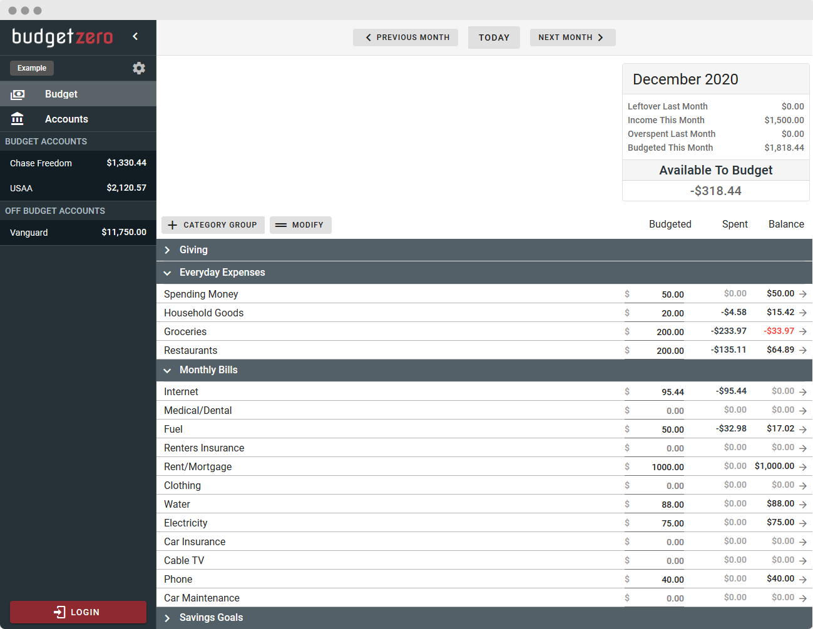

# <a href="https://app.budgetzero.io"><p align="center"></p>
[](https://app.netlify.com/sites/budgetzero/deploys)


  
BudgetZero is a free, open-source, privacy-friendly, offline-first budgeting system.  

Use it now at [BudgetZero.io](https://app.budgetzero.io) or self-host on your own server. Zero ads, zero trackers, just budgeting.



:warning: BudgetZero is under active development and considered an alpha version. You may encounter significant bugs and breaking changes. Feel free to file an issue! :warning:

# Features
:heavy_check_mark: Zero-based 'envelope' budgeting   
:heavy_check_mark: Offline-first storage. NOTE: All data is stored in the browser and may be lost if you clear the browser's data.  
:heavy_check_mark: Import Transactions (OFX, QFX, CSV)  
:heavy_check_mark: Carry negative balances into next month  

# :warning: Known Issues (being worked on)
- UI Inconsistencies (pop-up boxes, colors, etc)
- Performance not optimized for large budgets (thousands of transactions)
- Transfer transactions work but may be a bit buggy
- Find a bug? Please [file an issue!](../../issues)


# Roadmap
- [ ] Reports
- [ ] Cloud Sync through Budgetzero.io (coming soon)
  - **_Interested in Cloud Sync?_** [Sign up to be notified when available!](https://app.budgetzero.io/login)
- [ ] Self-hosted sync server (coming soon)
- [ ] Cross-platform desktop applications (Windows, Mac, Linux)
- [ ] Multi-month view
- [ ] Payee management

# Deployment
## Use at budgetzero.io
No need to deploy if you want to use it at [app.budgetzero.io](https://app.budgetzero.io)

## Docker 
```
docker pull budgetzero/budgetzero:latest
```
Then run with 
```
docker run -d -p <desired_port>:8080 --name budgetzero budgetzero/budgetzero
```
Example:
```
docker run -d -p 8080:8080 --name budgetzero budgetzero/budgetzero
```
Your budgetzero instance is now running at <docker_IP>:<desired_port>

## Manual Deployment
You can also build the static files and host on any webserver.
```
npm install
npm run build
```
The files will be built into the dist/ folder and can be hosted anywhere.


# Development
## Pull Requests

Good pull requests (patches, improvements, new features) are a greatly appreciated.

Please ask first before embarking on any significant pull request (e.g. implementing features, refactoring code), otherwise, you risk spending a lot of time working on something that might not get accepted or is already in development.

## Dev Setup
```
npm install
```

### To start a development web server:
```
npm run serve
```

### Run tests
Run all tests once:
```
npm run test:unit
```

Run all tests and re-run if files change:  
```
npm run test-watch:unit
```

Run with debugger (chrome://inspect)
```
node --inspect node_modules/.bin/jest --runInBand tests/unit/Transactions.spec.js    
```

